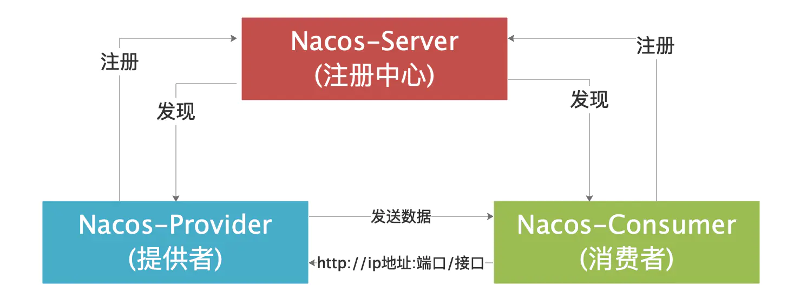
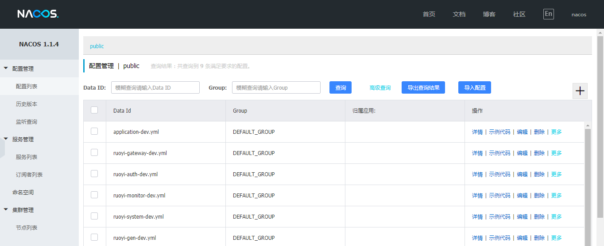
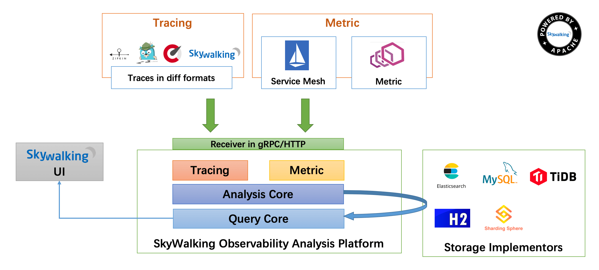
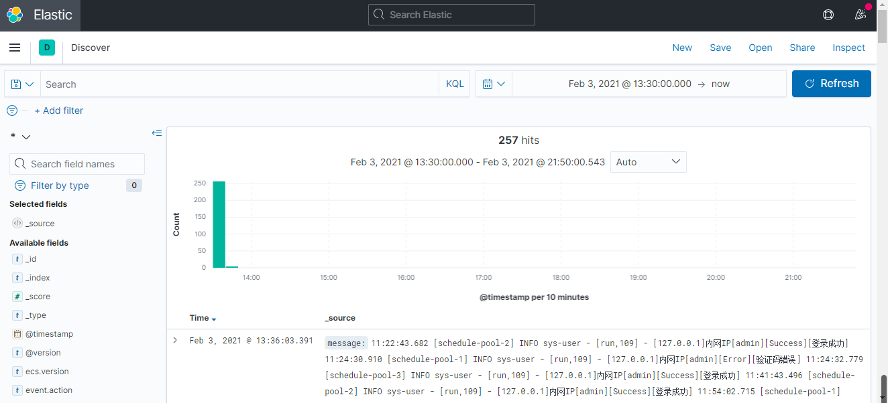

# 微服务文档

## 服务网关

### 基本介绍基本介绍

- Spring Cloud Gateway

`Spring Cloud Gateway`是基于`Spring`生态系统之上构建的`API`网关，包括：`Spring 5.x`，`Spring Boot 2.x`和`Project Reactor`。`Spring Cloud Gateway`旨在提供一种简单而有效的方法来路由到`API`，并为它们提供跨领域的关注点，例如：`安全性`，`监视/指标`，`限流`等。

- 什么是服务网关

`API Gateway（APIGW / API 网关）`，顾名思义，是系统对外的唯一入口。`API`网关封装了系统内部架构，为每个客户端提供定制的API。 近几年来移动应用与企业间互联需求的兴起。从以前单一的Web应用，扩展到多种使用场景，且每种使用场景对后台服务的要求都不尽相同。 这不仅增加了后台服务的响应量，还增加了后台服务的复杂性。随着微服务架构概念的提出，API网关成为了微服务架构的一个标配组件。

- 为什么要使用网关

微服务的应用可能部署在不同机房，不同地区，不同域名下。此时客户端（浏览器/手机/软件工具）想 要请求对应的服务，都需要知道机器的具体 IP 或者域名 URL，当微服务实例众多时，这是非常难以记忆的，对 于客户端来说也太复杂难以维护。此时就有了网关，客户端相关的请求直接发送到网关，由网关根据请求标识 解析判断出具体的微服务地址，再把请求转发到微服务实例。这其中的记忆功能就全部交由网关来操作了。

- 核心概念

`路由（Route）`：路由是网关最基础的部分，路由信息由 ID、目标 URI、一组断言和一组过滤器组成。如果断言 路由为真，则说明请求的 URI 和配置匹配。
`断言（Predicate）`：Java8 中的断言函数。Spring Cloud Gateway 中的断言函数输入类型是 Spring 5.0 框架中 的 ServerWebExchange。Spring Cloud Gateway 中的断言函数允许开发者去定义匹配来自于 Http Request 中的任 何信息，比如请求头和参数等。
`过滤器（Filter）`：一个标准的 Spring Web Filter。Spring Cloud Gateway 中的 Filter 分为两种类型，分别是 Gateway Filter 和 Global Filter。过滤器将会对请求和响应进行处理

### 使用网关

1. 添加依赖

   ```xml
   <!-- spring cloud gateway 依赖 -->
   <dependency>
   	<groupId>org.springframework.cloud</groupId>
   	<artifactId>spring-cloud-starter-gateway</artifactId>
   </dependency>
   ```

2. `resources/application.yml`配置文件

   ```yaml
   server:
     port: 8080
   
   spring: 
     application:
       name: service-gateway
     cloud:
       gateway:
         routes:
           # 系统模块
           - id: service-system
             uri: http://localhost:9201/
             predicates:
               - Path=/system/**
             filters:
               - StripPrefix=1
   ```

3. 网关启动类

   ```java
   @SpringBootApplication
   public class GatewayApplication
   {
       public static void main(String[] args)
       {
           SpringApplication.run(GatewayApplication.class, args);
   }
   ```

### 路由规则

`Spring Cloud Gateway`创建`Route`对象时， 使用`RoutePredicateFactory`创建`Predicate`对象，`Predicate`对象可以赋值给`Route`。

- `Spring Cloud Gateway`包含许多内置的`Route Predicate Factories`。
- 所有这些断言都匹配 HTTP 请求的不同属性。
- 多个`Route Predicate Factories`可以通过逻辑与`（and）`结合起来一起使用。

路由断言工厂`RoutePredicateFactory`包含的主要实现类如图所示，包括`Datetime`、请求的远端地址、路由权重、请求头、Host 地址、请求方法、请求路径和请求参数等类型的路由断言。

#### Datetime

匹配日期时间之后发生的请求

```yml
spring: 
  application:
    name: service-gateway
  cloud:
    gateway:
      routes:
        - id: service-system
          uri: http://localhost:9201/
          predicates:
            - After=2021-02-23T14:20:00.000+08:00[Asia/Shanghai]
```

#### Cookie

匹配指定名称且其值与正则表达式匹配的`cookie`

```yml
spring: 
  application:
    name: service-gateway
  cloud:
    gateway:
      routes:
        - id: service-system
          uri: http://localhost:9201/
          predicates:
            - Cookie=loginname
```

测试 `curl http://localhost:8080/system/config/1 --cookie "loginname=wyl"`

#### Header

匹配具有指定名称的请求头，`\d+`值匹配正则表达式

```yml
spring: 
  application:
    name: service-gateway
  cloud:
    gateway:
      routes:
        - id: service-system
          uri: http://localhost:9201/
          predicates:
            - Header=X-Request-Id, \d+
```

#### Host

匹配主机名的列表

```yml
spring: 
  application:
    name: service-gateway
  cloud:
    gateway:
      routes:
        - id: service-system
          uri: http://localhost:9201/
          predicates:
            - Host=**.somehost.org,**.anotherhost.org
```

#### Method

匹配请求methods的参数，它是一个或多个参数

```yml
spring: 
  application:
    name: service-gateway
  cloud:
    gateway:
      routes:
        - id: service-system
          uri: http://localhost:9201/
          predicates:
            - Method=GET,POST
```

#### Path

匹配请求路径

```yml
spring: 
  application:
    name: service-gateway
  cloud:
    gateway:
      routes:
        - id: service-system
          uri: http://localhost:9201/
          predicates:
            - Path=/system/**
```

#### Query

匹配查询参数

```yml
spring: 
  application:
    name: service-gateway
  cloud:
    gateway:
      routes:
        - id: service-system
          uri: http://localhost:9201/
          predicates:
            - Query=username, abc.
```

#### RemoteAddr

匹配IP地址和子网掩码

```yml
spring: 
  application:
    name: service-gateway
  cloud:
    gateway:
      routes:
        - id: service-system
          uri: http://localhost:9201/
          predicates:
            - RemoteAddr=192.168.10.1/0
```

#### Weight

匹配权重

```yml
spring: 
  application:
    name: service-gateway
  cloud:
    gateway:
      routes:
        - id: service-system-a
          uri: http://localhost:9201/
          predicates:
            - Weight=group1, 8
        - id: service-system-b
          uri: http://localhost:9201/
          predicates:
            - Weight=group1, 2
```

### 路由配置

在`spring cloud gateway`中配置`uri`有三种方式，包括

- websocket配置方式

```yml
spring:
  cloud:
    gateway:
      routes:
        - id: service-api
          uri: ws://localhost:9090/
          predicates:
            - Path=/api/**
```

- http地址配置方式

```yml
spring:
  cloud:
    gateway:
      routes:
        - id: service-api
          uri: http://localhost:9090/
          predicates:
            - Path=/api/**
```

- 注册中心配置方式

```yml
spring:
  cloud:
    gateway:
      routes:
        - id: service-api
          uri: lb://service-api
          predicates:
            - Path=/api/**
```

### 限流配置

顾名思义，限流就是限制流量。通过限流，我们可以很好地控制系统的 QPS，从而达到保护系统的目的。
常见的限流算法有：`计数器`算法，`漏桶（Leaky Bucket）`算法，`令牌桶（Token Bucket）`算法。

`Spring Cloud Gateway`官方提供了`RequestRateLimiterGatewayFilterFactory`过滤器工厂，使用`Redis` 和`Lua`脚本实现了令牌桶的方式。

1. 添加依赖

```xml
<!-- spring data redis reactive 依赖 -->
<dependency>
  <groupId>org.springframework.boot</groupId>
  <artifactId>spring-boot-starter-data-redis-reactive</artifactId>
</dependency>
```

2. 限流规则，根据`URI`限流

```yml
spring:
  redis:
    host: localhost
    port: 6379
    password: 
  cloud:
    gateway:
      routes:
        # 系统模块
        - id: service-system
          uri: lb://service-system
          predicates:
            - Path=/system/**
          filters:
            - StripPrefix=1
            - name: RequestRateLimiter
              args:
                redis-rate-limiter.replenishRate: 1 # 令牌桶每秒填充速率
                redis-rate-limiter.burstCapacity: 2 # 令牌桶总容量
                key-resolver: "#{@pathKeyResolver}" # 使用 SpEL 表达式按名称引用 bean
```

>  提示
>
> `StripPrefix=1`配置，表示网关转发到业务模块时候会自动截取前缀。

3. 编写`URI`限流规则配置类

```java
/**
 * 限流规则配置类
 */
@Configuration
public class KeyResolverConfiguration
{
    @Bean
    public KeyResolver pathKeyResolver()
    {
        return exchange -> Mono.just(exchange.getRequest().getURI().getPath());
    }
}
```

### 熔断降级

1. 添加依赖

```xml
<dependency>
    <groupId>org.springframework.cloud</groupId>
    <artifactId>spring-cloud-starter-netflix-hystrix</artifactId>
</dependency>
```

2. 配置需要熔断降级服务

```yaml
spring:
  redis:
    host: localhost
    port: 6379
    password: 
  cloud:
    gateway:
      routes:
        # 系统模块
        - id: service-system
          uri: lb://service-system
          predicates:
            - Path=/system/**
          filters:
            - StripPrefix=1
            # 降级配置
            - name: Hystrix
              args:
                name: default
                # 降级接口的地址
                fallbackUri: 'forward:/fallback'
```

> 提示
>
> 上面配置包含了一个`Hystrix`过滤器，该过滤器会应用`Hystrix`熔断与降级，会将请求包装成名为`fallback`的路由指令`RouteHystrixCommand`，`RouteHystrixCommand`继承于`HystrixObservableCommand`，其内包含了`Hystrix`的断路、资源隔离、降级等诸多断路器核心功能，当网关转发的请求出现问题时，网关能对其进行快速失败，执行特定的失败逻辑，保护网关安全。
>
> 配置中有一个可选参数`fallbackUri`，当前只支持`forward`模式的`URI`。如果服务被降级，请求会被转发到该`URI`对应的控制器。控制器可以是自定义的`fallback`接口；也可以使自定义的`Handler`，需要实现接口`org.springframework.web.reactive.function.server.HandlerFunction<T extends ServerResponse>`。

3. 实现添加熔断降级处理返回信息

```java
@Component
public class HystrixFallbackHandler implements HandlerFunction<ServerResponse>
{
    private static final Logger log = LoggerFactory.getLogger(HystrixFallbackHandler.class);

    @Override
    public Mono<ServerResponse> handle(ServerRequest serverRequest)
    {
        Optional<Object> originalUris = serverRequest.attribute(GATEWAY_ORIGINAL_REQUEST_URL_ATTR);
        originalUris.ifPresent(originalUri -> log.error("网关执行请求:{}失败,hystrix服务降级处理", originalUri));
        return ServerResponse.status(HttpStatus.INTERNAL_SERVER_ERROR.value()).contentType(MediaType.APPLICATION_JSON)
                .body(BodyInserters.fromValue(JSON.toJSONString(R.fail("服务已被降级熔断"))));
    }
}
```

4. 路由配置信息加一个控制器方法用于处理重定向的`/fallback`请求

```java
@Configuration
public class RouterFunctionConfiguration
{
    @Autowired
    private HystrixFallbackHandler hystrixFallbackHandler;

    @SuppressWarnings("rawtypes")
    @Bean
    public RouterFunction routerFunction()
    {
        return RouterFunctions
                .route(RequestPredicates.path("/fallback").and(RequestPredicates.accept(MediaType.TEXT_PLAIN)),
                        hystrixFallbackHandler)
    }
}
```

### 跨域配置

项目采用的是前后端分离，如果页面直接调用后端的域名或IP，故存在跨域问题。

配置方式：**可以在`nacos`配置中心`gateway-dev.yml`文件中加入以下配置解决跨域问题**

```yml
spring:
  cloud:
    gateway:
      globalcors:
        corsConfigurations:
          '[/**]':
            allowedOriginPatterns: "*"
            allowed-methods: "*"
            allowed-headers: "*"
            allow-credentials: true
            exposedHeaders: "Content-Disposition,Content-Type,Cache-Control"
```

代码方式：**新增`CorsConfig.java`跨域代码配置**

```java
@Configuration
public class CorsConfig
{
    /**
     * 这里为支持的请求头，如果有自定义的header字段请自己添加
     */
    private static final String ALLOWED_HEADERS = "X-Requested-With, Content-Type, Authorization, credential, X-XSRF-TOKEN, token, Admin-Token, App-Token";
    private static final String ALLOWED_METHODS = "GET,POST,PUT,DELETE,OPTIONS,HEAD";
    private static final String ALLOWED_ORIGIN = "*";
    private static final String ALLOWED_EXPOSE = "*";
    private static final String MAX_AGE = "18000L";

    @Bean
    public WebFilter corsFilter()
    {
        return (ServerWebExchange ctx, WebFilterChain chain) -> {
            ServerHttpRequest request = ctx.getRequest();
            if (CorsUtils.isCorsRequest(request))
            {
                ServerHttpResponse response = ctx.getResponse();
                HttpHeaders headers = response.getHeaders();
                headers.add("Access-Control-Allow-Headers", ALLOWED_HEADERS);
                headers.add("Access-Control-Allow-Methods", ALLOWED_METHODS);
                headers.add("Access-Control-Allow-Origin", ALLOWED_ORIGIN);
                headers.add("Access-Control-Expose-Headers", ALLOWED_EXPOSE);
                headers.add("Access-Control-Max-Age", MAX_AGE);
                headers.add("Access-Control-Allow-Credentials", "true");
                if (request.getMethod() == HttpMethod.OPTIONS)
                {
                    response.setStatusCode(HttpStatus.OK);
                    return Mono.empty();
                }
            }
            return chain.filter(ctx);
        };
    }
}
```

### 黑名单配置

顾名思义，就是不能访问的地址。实现自定义过滤器`BlackListUrlFilter`，需要配置黑名单地址列表`blacklistUrl`，当然有其他需求也可以实现自定义规则的过滤器。

```yml
spring:
  cloud:
    gateway:
      routes:
        # 系统模块
        - id: service-system
          uri: lb://service-system
          predicates:
            - Path=/system/**
          filters:
            - StripPrefix=1
            - name: BlackListUrlFilter
              args:
                blacklistUrl:
                - /user/list
```

### 全局过滤器

全局过滤器作用于所有的路由，不需要单独配置，我们可以用它来实现很多统一化处理的业务需求，比如权限认证，IP访问限制等等。目前网关统一鉴权`AuthFilter.java`就是采用的全局过滤器。

单独定义只需要实现`GlobalFilter`, `Ordered`这两个接口就可以了。

```java
@Component
public class AuthFilter implements GlobalFilter, Ordered
{
    @Override
    public Mono<Void> filter(ServerWebExchange exchange, GatewayFilterChain chain)
    {
        String token = exchange.getRequest().getQueryParams().getFirst("token");
        if (null == token)
        {
            ServerHttpResponse response = exchange.getResponse();
            response.getHeaders().add("Content-Type", "application/json; charset=utf-8");
            String message = "{\"message\":\"请求token信息不能为空\"}";
            DataBuffer buffer = response.bufferFactory().wrap(message.getBytes());
            return response.writeWith(Mono.just(buffer));
        }
        return chain.filter(exchange);
    }

    @Override
    public int getOrder()
    {
        return 0;
    }
}
```

### 实现Sentinel限流

Sentinel 支持对 Spring Cloud Gateway、Netflix Zuul 等主流的 API Gateway 进行限流。

1. 添加依赖

```xml
<!-- SpringCloud Alibaba Sentinel -->
<dependency>
	<groupId>com.alibaba.cloud</groupId>
	<artifactId>spring-cloud-starter-alibaba-sentinel</artifactId>
</dependency>
		
<!-- SpringCloud Alibaba Sentinel Gateway -->
<dependency>
	<groupId>com.alibaba.cloud</groupId>
	<artifactId>spring-cloud-alibaba-sentinel-gateway</artifactId>
</dependency>
```

2. 限流规则配置类

```java
@Configuration
public class GatewayConfig
{
    @Bean
    @Order(Ordered.HIGHEST_PRECEDENCE)
    public SentinelFallbackHandler sentinelGatewayExceptionHandler()
    {
        return new SentinelFallbackHandler();
    }

    @Bean
    @Order(-1)
    public GlobalFilter sentinelGatewayFilter()
    {
        return new SentinelGatewayFilter();
    }

    @PostConstruct
    public void doInit()
    {
        // 加载网关限流规则
        initGatewayRules();
    }

    /**
     * 网关限流规则   
     */
    private void initGatewayRules()
    {
        Set<GatewayFlowRule> rules = new HashSet<>();
        rules.add(new GatewayFlowRule("service-system")
                .setCount(3) // 限流阈值
                .setIntervalSec(60)); // 统计时间窗口，单位是秒，默认是 1 秒
        // 加载网关限流规则
        GatewayRuleManager.loadRules(rules);
    }
}
```

3. 测试验证，一分钟内访问三次系统服务出现异常提示表示限流成功。

### Sentinel分组限流

对`service-system`、`service-gen`分组限流配置

1. `application.yml`配置文件

```yml
spring:
  cloud:
    gateway:
      routes:
        # 系统模块
        - id: service-system
          uri: lb://service-system
          predicates:
            - Path=/system/**
          filters:
            - StripPrefix=1
        # 代码生成
        - id: service-gen
          uri: lb://service-gen
          predicates:
            - Path=/code/**
          filters:
            - StripPrefix=1
```

2. 限流规则配置类

```java
@Configuration
public class GatewayConfig
{
    @Bean
    @Order(Ordered.HIGHEST_PRECEDENCE)
    public SentinelFallbackHandler sentinelGatewayExceptionHandler()
    {
        return new SentinelFallbackHandler();
    }

    @Bean
    @Order(-1)
    public GlobalFilter sentinelGatewayFilter()
    {
        return new SentinelGatewayFilter();
    }

    @PostConstruct
    public void doInit()
    {
        // 加载网关限流规则
        initGatewayRules();
    }

    /**
     * 网关限流规则   
     */
    private void initGatewayRules()
    {
        Set<GatewayFlowRule> rules = new HashSet<>();
        rules.add(new GatewayFlowRule("system-api")
                .setCount(3) // 限流阈值
                .setIntervalSec(60)); // 统计时间窗口，单位是秒，默认是 1 秒
        rules.add(new GatewayFlowRule("code-api")
                .setCount(5) // 限流阈值
                .setIntervalSec(60));
        // 加载网关限流规则
        GatewayRuleManager.loadRules(rules);
        // 加载限流分组
        initCustomizedApis();
    }

    /**
     * 限流分组   
     */
    private void initCustomizedApis()
    {
        Set<ApiDefinition> definitions = new HashSet<>();
        // service-system 组
        ApiDefinition api1 = new ApiDefinition("system-api").setPredicateItems(new HashSet<ApiPredicateItem>()
        {
            private static final long serialVersionUID = 1L;
            {
                // 匹配 /user 以及其子路径的所有请求
                add(new ApiPathPredicateItem().setPattern("/system/user/**")
                        .setMatchStrategy(SentinelGatewayConstants.URL_MATCH_STRATEGY_PREFIX));
            }
        });
        // service-gen 组
        ApiDefinition api2 = new ApiDefinition("code-api").setPredicateItems(new HashSet<ApiPredicateItem>()
        {
            private static final long serialVersionUID = 1L;
            {
                // 只匹配 /job/list
                add(new ApiPathPredicateItem().setPattern("/code/gen/list"));
            }
        });
        definitions.add(api1);
        definitions.add(api2);
        // 加载限流分组
        GatewayApiDefinitionManager.loadApiDefinitions(definitions);
    }
}
```

访问：`http://localhost:8080/system/user/list` （触发限流 ）
访问：`http://localhost:8080/system/role/list` （不会触发限流）
访问：`http://localhost:8080/code/gen/list` （触发限流）
访问：`http://localhost:8080/code/gen/xxxx` （不会触发限流）

### Sentinel自定义异常

为了展示更加友好的限流提示， Sentinel支持自定义异常处理。

方案一：`yml`配置

```yml
# Spring
spring: 
  cloud:
    sentinel:
      scg:
        fallback:
          mode: response
          response-body: '{"code":403,"msg":"请求超过最大数，请稍后再试"}'
```

方案二：`GatewayConfig`注入`Bean`

```java
@Bean
@Order(Ordered.HIGHEST_PRECEDENCE)
public SentinelFallbackHandler sentinelGatewayExceptionHandler()
{
	return new SentinelFallbackHandler();
}
```

**SentinelFallbackHandler.java**

```java
public class SentinelFallbackHandler implements WebExceptionHandler
{
    private Mono<Void> writeResponse(ServerResponse response, ServerWebExchange exchange)
    {
        ServerHttpResponse serverHttpResponse = exchange.getResponse();
        serverHttpResponse.getHeaders().add("Content-Type", "application/json;charset=UTF-8");
        byte[] datas = "{\"code\":429,\"msg\":\"请求超过最大数，请稍后再试\"}".getBytes(StandardCharsets.UTF_8);
        DataBuffer buffer = serverHttpResponse.bufferFactory().wrap(datas);
        return serverHttpResponse.writeWith(Mono.just(buffer));
    }

    @Override
    public Mono<Void> handle(ServerWebExchange exchange, Throwable ex)
    {
        if (exchange.getResponse().isCommitted())
        {
            return Mono.error(ex);
        }
        if (!BlockException.isBlockException(ex))
        {
            return Mono.error(ex);
        }
        return handleBlockedRequest(exchange, ex).flatMap(response -> writeResponse(response, exchange));
    }

    private Mono<ServerResponse> handleBlockedRequest(ServerWebExchange exchange, Throwable throwable)
    {
        return GatewayCallbackManager.getBlockHandler().handleRequest(exchange, throwable);
    }
}
```

## 认证中心

在微服务架构中，由于不同的业务会拆分成不同的微服务，传统的单体项目一般是通过过滤器进行拦截校验，而微服务显然不可能分发到各个服务进行用户认证，这就需要由一个统一的地方来管理所有服务的认证信息，实现只登录一次，即可在各个服务的授权范围内进行操作；


## 注册中心

### 基本介绍

- 什么是注册中心

注册中心在微服务项目中扮演着非常重要的角色，是微服务架构中的纽带，类似于`通讯录`，它记录了服务和服务地址的映射关系。在分布式架构中，服务会注册到这里，当服务需要调用其它服务时，就到这里找到服务的地址，进行调用。

- 为什么要使用注册中心

注册中心解决了`服务发现`的问题。在没有注册中心时候，服务间调用需要知道被调方的地址或者代理地址。当服务更换部署地址，就不得不修改调用当中指定的地址或者修改代理配置。而有了注册中心之后，每个服务在调用别人的时候只需要知道服务名称就好，继续地址都会通过注册中心同步过来。

- Nacos 注册中心

`Nacos`是阿里巴巴开源的一个更易于构建云原生应用的动态服务发现、配置管理和服务管理平台。



### 安装

[Nacos 快速开始](https://nacos.io/zh-cn/docs/v2/quickstart/quick-start.html)



### 如何使用

1. 添加依赖

```xml
<!-- springcloud alibaba nacos discovery -->
<dependency>
	<groupId>com.alibaba.cloud</groupId>
	<artifactId>spring-cloud-starter-alibaba-nacos-discovery</artifactId>
</dependency>

<!-- springcloud loadbalancer -->
<dependency>
    <groupId>org.springframework.cloud</groupId>
    <artifactId>spring-cloud-loadbalancer</artifactId>
</dependency>

<!-- SpringBoot Web -->
<dependency>
	<groupId>org.springframework.boot</groupId>
	<artifactId>spring-boot-starter-web</artifactId>
</dependency>
```

2. 添加Nacos配置

```yml
# Spring
spring: 
  application:
    # 应用名称
    name: service-xxxx 
  cloud:
    nacos:
      discovery:
        # 服务注册地址
        server-addr: 127.0.0.1:8848
```

3. 在`Application`启动类加入注解`@SpringBootApplication`。
4. 启动服务，查看`Nacos`控制台的服务列表


### 测试验证

通过注册中心服务调用系统服务查询用户信息接口

```
@RestController
public class TestController
{
    @Autowired
    private RestTemplate restTemplate;

    // 新增restTemplate对象注入方法，注意，此处LoadBalanced注解一定要加上，否则无法远程调用
    @Bean
    @LoadBalanced
    public RestTemplate restTemplate()
    {
        return new RestTemplate();
    }

    @GetMapping("user")
    public String get()
    {
        return restTemplate.getForObject("http://service-path", String.class);
    }
}
```

访问`http://localhost:8888/user/admin`，返回用户数据成功表示测试通过。

## 配置中心

- 什么是配置中心

在微服务架构中，当系统从一个单体应用，被拆分成分布式系统上一个个服务节点后，配置文件也必须跟着迁移（分割），这样配置就分散了，不仅如此，分散中还包含着冗余，如下图：


总得来说，配置中心就是一种统一管理各种应用配置的基础服务组件。

- 为什么要使用配置中心

配置中心将配置从各应用中剥离出来，对配置进行统一管理，应用自身不需要自己去管理配置。

- Nacos 配置中心

`Nacos`是阿里巴巴开源的一个更易于构建云原生应用的动态服务发现、配置管理和服务管理平台。


配置中心的服务流程如下：

1、用户在配置中心更新配置信息。
2、服务A和服务B及时得到配置更新通知，从配置中心获取配置。

### 如何使用

1、添加依赖

```xml
<!-- springcloud alibaba nacos config -->
<dependency>
	<groupId>com.alibaba.cloud</groupId>
	<artifactId>spring-cloud-starter-alibaba-nacos-config</artifactId>
</dependency>

<!-- SpringBoot Web -->
<dependency>
	<groupId>org.springframework.boot</groupId>
	<artifactId>spring-boot-starter-web</artifactId>
</dependency>
```

2、在`bootstrap.yml`添加Nacos配置

```yml
# Spring
spring: 
  application:
    # 应用名称
    name: service-xxxx
  profiles:
    # 环境配置
    active: dev
  cloud:
    nacos:
      config:
        # 配置中心地址
        server-addr: 127.0.0.1:8848
        # 配置文件格式
        file-extension: yml
        # 共享配置
        shared-configs:
          - application-${spring.profiles.active}.${spring.cloud.nacos.config.file-extension}
```

配置文件加载的优先级（由高到低）
`bootstrap.properties ->bootstrap.yml -> application.properties -> application.yml`

3、在配置中心添加配置

### 动态刷新

通常会在`Controller`里边用`@Value`取出使用，但是你要是想改变他，就要重新改代码，打包，部署，十分麻烦，我们需要让配置文件的值变得动起来，`Nacos`也采用了`Spring Cloud`原生注解`@RefreshScope`实现配置自动更新。

```java
@RefreshScope //动态刷新配置
public class TestController 
{
    @Value("${service.name}")
    private String name;

    @Value("${service.version}")
    private String version;
	
    ....
}
```

## 服务调用

- Feign

Feign 是`Spring Cloud Netflix`组件中的一量级`Restful`的 HTTP 服务客户端，实现了负载均衡和 Rest 调用的开源框架，封装了`Ribbon`和`RestTemplate`, 实现了`WebService`的面向接口编程，进一步降低了项目的耦合度。

- 什么是服务调用

顾名思义，就是服务之间的接口互相调用，在微服务架构中很多功能都需要调用多个服务才能完成某一项功能。

- 为什么要使用Feign

Feign 旨在使编写 JAVA HTTP 客户端变得更加简单，Feign 简化了`RestTemplate`代码，实现了`Ribbon`负载均衡，使代码变得更加简洁，也少了客户端调用的代码，使用 Feign 实现负载均衡是首选方案，只需要你创建一个接口，然后在上面添加注解即可。
Feign 是声明式服务调用组件，其核心就是：像调用本地方法一样调用远程方法，无感知远程 HTTP 请求。让开发者调用远程接口就跟调用本地方法一样的体验，开发者完全无感知这是远程方法，无需关注与远程的交互细节，更无需关注分布式环境开发。

- Feign vs OpenFeign

Feign 内置了`Ribbon`，用来做客户端负载均衡调用服务注册中心的服务。
Feign 支持的注解和用法参考官方文档：`https://github.com/OpenFeign/feign`官方文档，使用 Feign 的注解定义接口，然后调用这个接口，就可以调用服务注册中心的服务。

`Feign`本身并不支持`Spring MVC`的注解，它有一套自己的注解，为了更方便的使用`Spring Cloud`孵化了`OpenFeign`。并且支持了`Spring MVC`的注解，如`@RequestMapping`，`@PathVariable`等等。
`OpenFeign`的`@FeignClient`可以解析`Spring MVC`的`@RequestMapping`注解下的接口，并通过动态代理方式产生实现类，实现类中做负载均衡调用服务。

### 如何使用

1. 添加依赖

```xml
<!-- spring cloud openfeign -->
<dependency>
	<groupId>org.springframework.cloud</groupId>
	<artifactId>spring-cloud-starter-openfeign</artifactId>
</dependency>
```

2. 新建`RemoteUserService.java`服务接口

```java
@FeignClient(contextId = "remoteUserService", value = ServiceNameConstants.SYSTEM_SERVICE, fallbackFactory = RemoteUserFallbackFactory.class)
public interface RemoteUserService
{
    /**
     * 通过用户名查询用户信息
     *
     * @param username 用户名
     * @return 结果
     */
    @GetMapping(value = "/user/info/{username}")
    public R<LoginUser> getUserInfo(@PathVariable("username") String username);
}
```

## 链路追踪

#### 基本介绍基本介绍

- 什么是链路追踪

随着微服务分布式系统变得日趋复杂，越来越多的组件开始走向分布式化，如分布式服务、分布式数据库、分布式缓存等，使得后台服务构成了一种复杂的分布式网络。在服务能力提升的同时，复杂的网络结构也使问题定位更加困难。在一个请求在经过诸多服务过程中，出现了某一个调用失败的情况，查询具体的异常由哪一个服务引起的就变得十分抓狂，问题定位和处理效率是也会非常低。

分布式链路追踪就是将一次分布式请求还原成调用链路，将一次分布式请求的调用情况集中展示，比如各个服务节点上的耗时、请求具体到达哪台机器上、每个服务节点的请求状态等等。

- 为什么要使用链路追踪

链路追踪为分布式应用的开发者提供了完整的调用链路还原、调用请求量统计、链路拓扑、应用依赖分析等工具，可以帮助开发者快速分析和诊断分布式应用架构下的性能瓶颈，提高微服务时代下的开发诊断效率。

- skywalking 链路追踪

`SkyWalking`是一个可观测性分析平台（Observability Analysis Platform 简称OAP）和应用性能管理系统（Application Performance Management 简称 APM）。

提供分布式链路追踪，服务网格（Service Mesh）遥测分析，度量（Metric）聚合和可视化一体化解决方案。

SkyWalking 特点

- 多语言自动探针，java，.Net Code ,Node.Js
- 多监控手段，语言探针和Service Mesh
- 轻量高效，不需要额外搭建大数据平台
- 模块化架构，UI ，存储《集群管理多种机制可选
- 支持警告
- 优秀的可视化效果。

下面是`SkyWalking`的架构图： 

#### 下载方式

- Windows平台安装包下载

可以从`http://skywalking.apache.org/downloads`下载`apache-skywalking-apm-$version.tar.gz`包。

Windows下载解压后（.tar.gz），直接点击`bin/startup.bat`就可以了，这个时候实际上是启动了两个项目，一个收集器，一个web页面。


- 打开控制台

`skywalking`提供了一个可视化的监控平台，安装好之后，在浏览器中输入([http://localhost:8080 (opens new window)](http://localhost:8080/))就可以访问了。（我使用的是8.3.0版本）


#### 如何使用

- 配置vm参数

`idea`配置`vm`参数

```text
-javaagent:D:\apache-skywalking-apm-bin\agent\skywalking-agent.jar
-Dskywalking.agent.service_name=service-gateway
-Dskywalking.collector.backend_service=localhost:11800
```

#### 链路跟踪

当我们访问一个服务，而他会调用另一个服务的时候，点击拓扑图会出现下图的效果，这就是链路跟踪的效果


#### 追踪调用链追踪调用链

在追踪界面，可以查看整个请求的具体调用链


## 分布式日志

### 基本介绍

- 什么是分布式日志

在分布式应用中，日志被分散在储存不同的设备上。如果你管理数十上百台服务器，你还在使用依次登录每台机器的传统方法查阅日志。这样是不是感觉很繁琐和效率低下。所以我们使用集中化的日志管理，分布式日志就是对大规模日志数据进行采集、追踪、处理。

- 为什么要使用分布式日志

一般我们需要进行日志分析场景：直接在日志文件中`grep`、`awk`就可以获得自己想要的信息。但在规模较大的场景中，此方法效率低下，面临问题包括日志量太大如何归档、文本搜索太慢怎么办、如何多维度查询。需要集中化的日志管理，所有服务器上的日志收集汇总。常见解决思路是建立集中式日志收集系统，将所有节点上的日志统一收集，管理，访问。

- ELK 分布式日志

实际上`ELK`是三款软件的简称，分别是`Elasticsearch`、 `Logstash`、`Kibana`组成。

**Elasticsearch** 基于`java`，是个开源分布式搜索引擎，它的特点有：分布式，零配置，自动发现，索引自动分片，索引副本机制，`restful`风格接口，多数据源，自动搜索负载等。

**Kibana** 基于`nodejs`，也是一个开源和免费的工具，`Kibana`可以为`Logstash`和`ElasticSearch`提供的日志分析友好的Web 界面，可以汇总、分析和搜索重要数据日志。

**Logstash** 基于`java`，是一个开源的用于收集,分析和存储日志的工具。

下面是`ELK`的工作原理： 

### Elasticsearch

#### 简介

ElasticSearch是一个基于Lucene的搜索服务器。它提供了一个分布式多用户能力的全文搜索引擎，基于RESTful web接口。Elasticsearch是用Java开发的，并作为Apache许可条款下的开放源码发布，是当前流行的企业级搜索引擎。设计用于云计算中，能够达到实时搜索，稳定，可靠，快速，安装使用方便。

我们建立一个网站或应用程序，并要添加搜索功能，但是想要完成搜索工作的创建是非常困难的。我们希望搜索解决方案要运行速度快，我们希望能有一个零配置和一个完全免费的搜索模式，我们希望能够简单地使用JSON通过HTTP来索引数据，我们希望我们的搜索服务器始终可用，我们希望能够从一台开始并扩展到数百台，我们要实时搜索，我们要简单的多租户，我们希望建立一个云的解决方案。因此我们利用Elasticsearch来解决所有这些问题及可能出现的更多其它问题。

ElasticSearch是Elastic Stack的核心，同时Elasticsearch 是一个分布式、RESTful风格的搜索和数据分析引擎，能够解决不断涌现出的各种用例。作为Elastic Stack的核心，它集中存储您的数据，帮助您发现意料之中以及意料之外的情况。

#### 下载

到官网下载： ([https://www.elastic.co/cn/downloads/elasticsearch (opens new window)](https://www.elastic.co/cn/downloads/elasticsearch)) 

#### 安装

- 解压到相应目录

```sh
tar -zxvf elasticsearch-7.10.2-linux-x86_64.tar.gz -C /usr/local
```

- 修改配置

```sh
cd /usr/local/elasticsearch-7.10.2/config/
vim elasticsearch.yml
```

```sh
node.name: node-1
path.data: /usr/local/elasticsearch-7.10.2/data
path.logs: /usr/local/elasticsearch-7.10.2/logs
network.host: 127.0.0.1
http.host: 0.0.0.0
http.port: 9200
discovery.seed_hosts: ["127.0.0.1"]
cluster.initial_master_nodes: ["node-1"]
```

- 创建`es`用户 因为`ElasticSearch`不支持`Root`用户直接操作，因此我们需要创建一个`es`用户

```sh
useradd es
chown -R es:es /usr/local/elasticsearch-7.10.2
```

#### 启动

- 切换用户成es用户进行操作

```sh
su - es
/usr/local/elasticsearch-7.10.2/bin/elasticsearch
```

- 后台启动

```sh
/usr/local/elasticsearch-7.10.2/bin/elasticsearch -d 
```

在浏览器打开`9200`端口地址： ([http://120.78.129.95:9200/ (opens new window)](http://120.78.129.95:9200/))，如果出现了下面的信息，就表示已经成功启动了 

### Logstash

#### 简介

Logstash是一个开源的服务器端数据处理管道，能够同时从多个来源采集数据，转换数据，然后将数据发送到最喜欢的存储库中（我们的存储库当然是ElasticSearch）

#### 下载

到官网下载： ([https://www.elastic.co/cn/downloads/logstash (opens new window)](https://www.elastic.co/cn/downloads/logstash))


#### 安装

- 解压到相应目录

```sh
tar -zxvf logstash-7.10.2.tar.gz -C /usr/local
```

- 新增配置文件

```sh
cd /usr/local/logstash-7.10.2/bin
vim logstash-elasticsearch.conf
```

```sh
input {
	stdin {}
}
output {
	elasticsearch {
		hosts => '120.78.129.95:9200'
	}
	stdout {
		codec => rubydebug
	}
}
```

#### 启动

```sh
./logstash -f logstash-elasticsearch.conf
```

### Kibana

#### 简介

Kibana 是一款开源的数据分析和可视化平台，它是 Elastic Stack 成员之一，设计用于和 Elasticsearch 协作。您可以使用 Kibana 对 Elasticsearch 索引中的数据进行搜索、查看、交互操作。您可以很方便的利用图表、表格及地图对数据进行多元化的分析和呈现。

#### 下载

到官网下载： ([https://www.elastic.co/cn/downloads/kibana (opens new window)](https://www.elastic.co/cn/downloads/kibana))


#### 安装

- 解压到相应目录

```sh
tar -zxvf kibana-7.10.2-linux-x86_64.tar.gz -C /usr/local
mv /usr/local/kibana-7.10.2-linux-x86_64 /usr/local/kibana-7.10.2
```

- 修改配置

```sh
cd /usr/local/kibana-7.10.2/config
vim kibana.yml
```

```sh
server.port: 5601 
server.host: "0.0.0.0" 
elasticsearch.hosts: ["http://120.78.129.95:9200"] 
kibana.index: ".kibana"
```

- 授权es用户

```text
chown -R es:es /usr/local/kibana-7.10.2/
```

#### 启动

- 切换用户成es用户进行操作

```sh
su - es
/usr/local/kibana-7.10.2/bin/kibana 
```

- 后台启动

```sh
/usr/local/kibana-7.10.2/bin/kibana &
```

在浏览器打开`5601`端口地址： ([http://120.78.129.95:5601/ (opens new window)](http://120.78.129.95:5601/))，如果出现了下面的信息，就表示已经成功启动了 

#### 切换中文

在`config/kibana.yml`添加

```yml
i18n.locale: "zh-CN"
```

#### 日志收集

对应服务器安装`logstash`，配置规则，例如新建`logstash-apache.conf`

```sh
input {
  file {
    path => "/home/logs/sys-*.log"
	start_position => beginning
	sincedb_path => "/dev/null"
	codec => multiline {
      pattern => "^\d{4}-\d{2}-\d{2} \d{2}:\d{2}:\d{2}"
      negate => true
      auto_flush_interval => 3
      what => previous
    }
  }
}

filter {
  if [path] =~ "info" {
    mutate { replace => { type => "sys-info" } }
    grok {
      match => { "message" => "%{COMBINEDAPACHELOG}" }
    }
    date {
      match => [ "timestamp" , "dd/MMM/yyyy:HH:mm:ss Z" ]
    }
  } else if [path] =~ "error" {
    mutate { replace => { type => "sys-error" } }
  } else {
    mutate { replace => { type => "random_logs" } }
  }
}

output {
  elasticsearch {
    hosts => '120.78.129.95:9200'
  }
  stdout { codec => rubydebug }
}
```

- 启动logstash

```sh
./logstash -f logstash-apache.conf
```

- 通过`kibana`可视化检索各个服务日志数据 