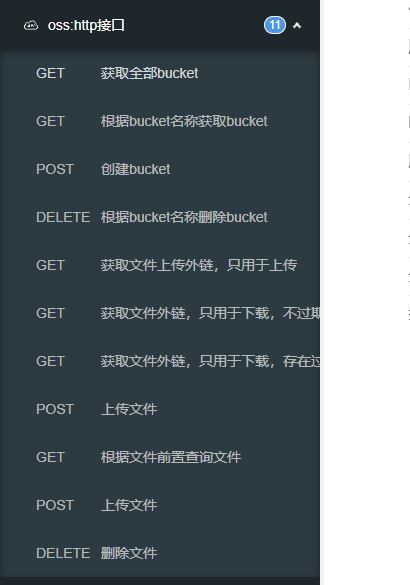

# 统一框架后端技术文档

## 介绍

**统一框架** 是一个 Java EE 分布式微服务架构平台，基于经典技术组合（Spring Boot、Spring Cloud & Alibaba），内置组件如：mybatis集成组件，oss集成组件、策略模式组件、缓存组件等。主要目的让开发者注重专注业务，降低技术难度，从而节省人力成本，缩短项目周期，提高软件安全质量。

## 技术选型

**1、系统环境**

- Java EE 8
- Servlet 3.0
- Apache Maven 3

**2、主框架**

- Spring Boot 2.7.x
- Spring Cloud 2021.0.3
- Spring Framework 5.3.x
- Sa-Token 1.34.0

**3、持久层**

- Apache MyBatis 3.5.x
- Hibernate Validation 6.2.x
- HikariCP 4.0.x

## 模块说明

``` lua
bcht-components
    ├── bcht-component-common -- 通用工具模块
    ├── bcht-component-demo -- 案例模块
    │   ├── bcht-component-common-demo
    │   ├── bcht-component-flyway-demo
    │   ├── bcht-component-springcloud-support-demo
    │   │   ├── bcht-component-service-consumer-demo
    │   │   ├── bcht-component-service-gateway-demo
    │   │   └── bcht-component-service-provider-demo
    │   └── bcht-component-starter-demo
    │       ├── bcht-component-cache-starter-demo
    │       ├── bcht-component-catchlog-starter-demo
    │       ├── bcht-component-elasticsearch-jdbc-demo
    │       ├── bcht-component-extension-starter-demo
    │       ├── bcht-component-mybatis-starter-demo
    │       ├── bcht-component-oss-starter-demo
    │       ├── bcht-component-security-starter-demo
    │       └── bcht-component-strategy-starter-demo
    ├── bcht-component-dependencies -- 统一依赖模块
    ├── bcht-component-spring spring -- spring级别组件模块
    │   └── bcht-component-spring-strategy -- 策略模式封装
    ├── bcht-component-springboot-support -- SpringBoot项目通用支持
    ├── bcht-component-springcloud-support -- SpringCloud项目通用支持
    ├── bcht-component-starter -- startrt组件父模块
    │   ├── bcht-component-cache-starter -- 缓存支持
    │   ├── bcht-component-catchlog-starter -- 异常支持
    │   ├── bcht-component-extension-starter -- 扩展点封装
    │   ├── bcht-component-gateway-starter -- 网关支持
    │   ├── bcht-component-log-collect-starter -- 日志收集
    │   ├── bcht-component-mybatis-starter -- mybatis支持
    │   ├── bcht-component-oss-starter -- 文件存储支持
    │   ├── bcht-component-security-starter -- 安全模块支持，简单登录和oauth2协议登录
    │   ├── bcht-component-springfox-starter -- 文档模块支持
    │   ├── bcht-component-strategy-starter -- 策略模式封装
    │   ├── bcht-component-websocket-starter -- websocket封装
    │   ├── bcht-component-xxl-job -- xxl-job客户端支持
    │   └── bcht-elasticsearch-connect-jdbc-starter -- 基于jdbc的操作es封装
    ├── docs -- 技术、运维文档
```

## 组件文档

###  通用工具模块

对应`bcht-component-common`模块

提供DTO规范，异常规范，常用工具类等功能。

#### DTO规范

制定了DTO的相关规范。定义了控制层请求和响应的格式。

##### 响应格式

###### 无数据时响应格式

```java
Response.buildSuccess();
// {"success":true}
Response.buildFailure(String errCode, String errMessage);
// {"success":false,"errCode":"BIZ_ERROR","errMessage":"业务异常"}
```

###### 单条数据相应格式

```java
SingleResponse.of(T data);
// {"data":"单数据","success":true}
// {"data":{"userId":"1","userName":"张三"},"success":true}
```

###### 列表数据相应格式

```java
MultiResponse.of(Collection<T> data);
// {"data":[{"userId":"1","userName":"张三"}],"success":true}
```

###### 分页数据相应格式

```java
PageResponse.of(Collection<T> data, int totalCount, int pageSize, int pageIndex)
// {"totalCount":1,"pageSize":1,"pageIndex":1,"data":[{"userId":"1","userName":"张三"}],"success":true}
```

##### 请求对象

###### 查询对象父类

`Query`

###### 分页查询对象

`PageQuery`

#### Exception规范

##### 介绍

制定了Exception的相关规范，一是，为了复用；二是，使得应用层面的Logging和异常处理AOP成为可能。

实际上，对于应用系统而言，只有三种类型的异常：
1. BizException：业务异常，有明确的业务语义，不需要记录Error日志，不需要Retry
2. SysException：已知的系统异常，需要记录Error日志，可以Retry
3. Exception：未知的其它异常，需要完整的Error Stack日志，可以Retry

##### 使用

- 异常工厂

  ```java
  // 工厂方式生产业务异常
  ExceptionFactory.bizException()
  // 工厂方式生产系统异常
  ExceptionFactory.sysException()
  ```

- 断言

  Java断言提供了一种有效的方法来检测和纠正编程错误。检查失败，抛出**业务异常**。

  ```java
  Assert.isTrue()
  Assert.notNull()
  ...
  ```

#### 树结构

##### 介绍

考虑到菜单等需求的普遍性，封装一个扩展性极好的树状结构实现。

- 这种树状结构可以根据配置文件灵活的定义节点之间的关系，也能很好的兼容关系数据库中数据，实现

  ```
  关系型数据库数据  <->  Tree  <->  JSON
  ```

- 灵活定义根节点

##### 使用

###### 定义结构

我们假设要构建一个菜单，可以实现系统管理和店铺管理，菜单的样子如下：

```
系统管理
    |- 用户管理
    |- 添加用户

店铺管理
    |- 商品管理
    |- 添加商品
```

那这种结构如何保存在数据库中呢？一般是这样的：

| id   | parentId | name     | weight |
| ---- | -------- | -------- | ------ |
| 1    | 0        | 系统管理 | 5      |
| 11   | 1        | 用户管理 | 10     |
| 111  | 1        | 用户添加 | 11     |
| 2    | 0        | 店铺管理 | 5      |
| 21   | 2        | 商品管理 | 10     |
| 221  | 2        | 添加添加 | 11     |

我们看到，每条数据根据`parentId`相互关联并表示层级关系，`parentId`在这里也叫外键。

###### 构建Tree

```java
// 构建node列表
List<TreeNode<String>> nodeList = CollUtil.newArrayList();

nodeList.add(new TreeNode<>("1", "0", "系统管理", 5));
nodeList.add(new TreeNode<>("11", "1", "用户管理", 222222));
nodeList.add(new TreeNode<>("111", "11", "用户添加", 0));
nodeList.add(new TreeNode<>("2", "0", "店铺管理", 1));
nodeList.add(new TreeNode<>("21", "2", "商品管理", 44));
nodeList.add(new TreeNode<>("221", "2", "商品管理2", 2));
```

> TreeNode表示一个抽象的节点，也表示数据库中一行数据。 如果有其它数据，可以调用`setExtra`添加扩展字段。

```java
List<Tree<String>> treeList = TreeUtil.build(nodeList);
```

因为两个Tree是平级的，再没有上层节点，因此为List。

###### 自定义字段名和断言式声明根节点

```java
//配置
TreeNodeConfig treeNodeConfig = new TreeNodeConfig();
// 自定义属性名 都要默认值的
treeNodeConfig.setWeightKey("order");
treeNodeConfig.setIdKey("rid");
treeNodeConfig.setDeep(2);

//转换器
List<Tree<String>> treeNodes = TreeUtil.build(nodeList, treeNode -> treeNode.getParent() == null, treeNodeConfig,
(treeNode, tree) -> {
    tree.setId(treeNode.getId());
    tree.setParentId(treeNode.getParentId());
    tree.setWeight(treeNode.getWeight());
    tree.setName(treeNode.getName());
    // 扩展属性 ...
    tree.putExtra("extraField", 666);
    tree.putExtra("other", new Object());
});
```

通过TreeNodeConfig我们可以自定义节点的名称、关系节点id名称，这样就可以和不同的数据库做对应。

`treeNode -> treeNode.getParent() == null`断言式声明根节点。

### mybatis集成组件

#### 原理

基于Mybatis/MyBatisPlus二次封装。

通过Spring Boot的autoConfig机制进行加载，无需手动配置，只需要添加如下依赖即可：

```xml
<dependency>
    <groupId>com.bcht</groupId>
    <artifactId>bcht-component-mybatis-starter</artifactId>
</dependency>
```

#### 使用介绍

##### 自动填充功能

```java
// 创建人
@TableField(fill = FieldFill.INSERT)
private String createBy;
// 更新人
@TableField(fill = FieldFill.INSERT_UPDATE)
private String updateBy;
// 创建时间
@TableField(fill = FieldFill.INSERT)
private LocalDateTime createTime;
// 更新时间
@TableField(fill = FieldFill.INSERT_UPDATE)
private LocalDateTime updateTime;
```

> 注意：字段和字段类型必须跟如上实例保持一致，否则注入功能不生效。

#####  字段数据绑定（字典回写）

- 注解 @FieldBind

|  属性  |  类型  | 必须指定 | 默认值 | 描述                                               |
| :----: | :----: | :------: | :----: | -------------------------------------------------- |
|  type  | String |    是    |        | 类型（用于区分不同业务）                           |
| target | String |    是    |        | 目标显示属性（待绑定属性，注意非数据库字段请排除） |

- 数据库 `sex` 值 `0`、`1` 自动映射为 `男`、`女`

- 可以绑定映射为对象，例如：根据订单 ID 映射 订单对象或者编号

  ```java
  @FieldBind(type = "user_sex", target = "sexText")
  private Integer sex;
  // 绑定显示属性，非表字典（排除）
  @TableField(exist = false)
  private String sexText;
  ```

- 绑定业务处理类需要实现 IDataBind 接口，注入 spring 容器

  ```java
  @Component
  public class DataBind implements IDataBind {
    ...
  }
  ```

##### 数据权限

###### 原理

基于MybatisPlus的拦截器改写sql。

###### 使用

1. 添加拦截器配置

   ```java
   @Bean
   public MybatisPlusInterceptor mybatisPlusInterceptor() {
       MybatisPlusInterceptor interceptor = new MybatisPlusInterceptor();
   
       DataPermissionInterceptor dataPermissionInterceptor = new DataPermissionInterceptor();
       MyDataPermissionHandler myDataPermissionHandler = new MyDataPermissionHandler();
       // 添加自定义的数据权限处理器
       dataPermissionInterceptor.setDataPermissionHandler(myDataPermissionHandler);
   
       interceptor.addInnerInterceptor(dataPermissionInterceptor);
       return interceptor;
   }
   ```

2. 自定义拦截器重写sql

   ```java
   @Slf4j
   public class MyDataPermissionHandler implements DataPermissionHandler {
   
       private static Map<String, DataScope> dataScopeMap = new ConcurrentHashMap();
       // 对应mapper是否初始化 1 初始化 0 未初始化
       private static Map<String, String> initMap = new ConcurrentHashMap();
   
       @Override
       public Expression getSqlSegment(Expression where, String mappedStatementId) {
           log.info("=========================== start MyDataPermissionHandler");
           // 配合自定义的 DataScope 注解
           initMap.computeIfAbsent(mappedStatementId, (k) -> {
               int index = mappedStatementId.lastIndexOf(".");
               String className = mappedStatementId.substring(0, index);
               DataScope dataScope = dataScopeMap.get(mappedStatementId);
               Class mappedStatementClass = null;
               try {
                   mappedStatementClass = Class.forName(className);
               } catch (ClassNotFoundException e) {
               }
               Method[] methods = mappedStatementClass.getMethods();
               for (int i = 0; i < methods.length; i++) {
                   Method method = methods[i];
                   DataScope dataScope1 = (DataScope) method.getAnnotation(DataScope.class);
                   if (null != dataScope1) {
                       dataScopeMap.put(mappedStatementId, dataScope1);
                   }
               }
               return "1";
           });
   
           // 根据权限设计拼接sql
           ItemsList itemsList = new ExpressionList(Arrays.asList(
               new StringValue("1"),
               new StringValue("2"),
               new StringValue("3"),
               new StringValue("5")
           ));
           InExpression inExpression = new InExpression(new Column(dataScopeMap.get(mappedStatementId).userAlias()), itemsList);
   
           return ObjectUtil.isNotEmpty(where) ? new AndExpression(where, new Parenthesis(inExpression)) : inExpression;
       }
   
       enum DataPermissionEnum {
   
           ALL("1", "拥有所有数据权限"),
           NONE("2", "未拥有数据权限"),
           DEPT("3", "拥有部门权限"),
           DEPT_CHILDREN("4", "拥有部门权限及子权限"),
           OWN("7", "拥有自身权限"),
           ;
   
           private String code;
           private String desc;
   
           DataPermissionEnum(String code, String desc) {
               this.code = code;
               this.desc = desc;
           }
   
           public String getCode() {
               return code;
           }
   
           public void setCode(String code) {
               this.code = code;
           }
   
           public String getDesc() {
               return desc;
           }
   
           public void setDesc(String desc) {
               this.desc = desc;
           }
   
       }
   
   }
   ```

   

### 策略模式封装

#### 什么是策略模式？

我们平时遇到支付的时候，我们会考虑是用 **支付宝**，**微信**，还是**云闪付**去完成 **支付** 这个动作。如果你选择微信，那你就用微信去完成支付。这个场景其实就是一种策略选择。
 策略模式其实就是不同的主体都可以完成同一行为（行为过程不一样，结果一样）。
 换成编程的思想上来说，就是在策略模式中，我们创建表示各种策略的对象和一个行为随着策略对象改变而改变的 context 对象。策略对象改变 context 对象的执行算法。

#### 使用介绍

##### 添加依赖

```xml
<dependency>
    <groupId>com.bcht</groupId>
    <artifactId>bcht-component-strategy-starter</artifactId>
</dependency>
```

##### 策略代码编写

```java
public interface StrategyI {

    String test();

}

@StrategyIdentifier(identifyCode = "A")
public class AStrategyI implements StrategyI {

    @Override
    public String test() {
        System.out.println("A");
        return "A";
    }

}

@StrategyIdentifier(identifyCode = "B")
public class BStrategyI implements StrategyI {

    @Override
    public String test() {
        System.out.println("B");
        return "B";
    }

}

// 策略模式调用测试
@SpringBootApplication(scanBasePackages = "com.bcht")
@SpringBootTest
public class EasyStrategyTest {

    @EasyStrategy
    EasyStrategyContainer<StrategyI> strategyContainer;

    @EasyStrategy
    EasyStrategyContainer<StrategyI> strategyContainerSample;

    @EasyStrategy
    StrategyContainer<String, StrategyI> strategyContainer2;

    @Test
    public void testCache() {
        Assertions.assertEquals(strategyContainer, strategyContainerSample);
    }

    @Test
    public void test111() {
        strategyContainer.getStrategy("A"); // 根据参数可以获取到不同的策略
        Assertions.assertEquals(strategyContainer.getStrategy("A").test(), "A");
        Assertions.assertEquals(strategyContainer.getStrategy("B").test(), "B");
        Assertions.assertEquals(strategyContainer2.getStrategy("B").test(), "B");
        Assertions.assertEquals(strategyContainer2.getStrategy("B").test(), "B");
    }

}
```

##### 自定义策略注解使用方式

请参考组件`bcht-component-spring-strategy`模块

### 通用文件存储服务

兼容S3 协议的通用文件存储工具类 ，支持 兼容S3 协议的云存储 

- MINIO
- 阿里云
- 华为云
- 腾讯云
- 京东云

...

#### spring boot starter依赖

- 方便在 web 环境下使用 `oss` ，已上传至 maven 仓库
```xml
<dependency>
    <groupId>com.bcht</groupId>
    <artifactId>bcht-component-oss-starter</artifactId>
    <version>最新版本号</version>
</dependency>
```

#### 使用方法

##### 配置文件

```yaml
oss:
  endpoint: http://10.20.10.152:30909
  access-key: O5HXUY8RI5KQE1I1UNDF
  secret-key: aydNYw2Q70nBwCEBGy+ASNpea+DT5+6MAH1a+l77
  http:
    # 是否开启默认的http端点
    enable: true
    # 默认http端点前缀配置 
    prefix: led
```

##### 代码使用

```java
@Autowired
private OssTemplate template;
/**
 * 上传文件
 * 文件名采用uuid,避免原始文件名中带"-"符号导致下载的时候解析出现异常
 *
 * @param file 资源
 * @return R(bucketName, filename)
 */
@PostMapping("/upload")
public R upload(@RequestParam("file") MultipartFile file, HttpServletRequest request) {
	template.putObject(CommonConstants.BUCKET_NAME, fileName, file.getInputStream());
	return R.ok(resultMap);
}
```

##### 开启默认端点

```yaml
oss:
  http:
    # 是否开启默认的http端点
    enable: true
```

提供默认端口如下：




### 认证服务

一个轻量级权限认证模块，基于sa-token封装，实现了见到那认证和基于Oauth2协议的认证。

#### spring boot starter依赖

```xml
<dependency>
    <groupId>com.bcht</groupId>
    <artifactId>bcht-component-security-starter</artifactId>
    <version>最新版本号</version>
</dependency>
```

#### 参考配置

```yaml
sa-token:
  # token名称 (同时也是cookie名称)
  token-name: satoken
  # 是否打开自动续签
  auto-renew: true
  # jwt秘钥
  jwt-secret-key: asdasdasifhueuiwyurfewbfjsdafjk
  # token临时有效期（30分钟内无操作就过期）
  # activity-timeout: 1800
  #cookie:
  #  # 域（写入Cookie时显式指定的作用域, 常用于单点登录二级域名共享Cookie的场景）
  #  domain: localhost
  is-read-cookie: true
  # 是否允许同一账号并发登录 (为true时允许一起登录, 为false时新登录挤掉旧登录)
  is-concurrent: true
  # OAuth2.0 配置 
  oauth2: 
    is-code: true
    is-implicit: false
    is-password: true
    is-client: true
bcht:
  security:
    enabled-anno-intercept: true
    enabled-oauth2: true
    # 用户详情服务配置，可以实现UserDetailsService接口自定义服务
    user-detail-service: jdbc1 
    # 内存模式下使用，仅限于测试使用
    users:
      - name: admin
        password: 123456
    oauth2:
      client-models:
        - client_id: vv7p6p4x1qs99knx
          client_secret: secret
          contractScope: userinfo
          isCode: true
          isAutoMode: true
          allowUrl: '*'
```

### 缓存组件集成

基于jetCache进行封装，JetCache 是一个基于 Java 的缓存系统封装，提供统一的 API 和注解来简化缓存的使用。

具体使用方法参考官方文档[jetcache](https://github.com/alibaba/jetcache/blob/master/introduce_CN.md)。

#### spring boot starter依赖

```xml
<dependency>
    <groupId>com.bcht</groupId>
    <artifactId>bcht-component-cache-starter</artifactId>
    <version>最新版本号</version>
</dependency>
```

### 网关组件集成

网关的作用比较多，网关可以做鉴权、限流、日志等功能。当前组件模块扩展功能如下：

- swagger API收集
- 自定义负载均衡路由策略，解决微服务开发开发环境下难以调试的问题。

#### spring boot starter依赖

```xml
<dependency>
    <groupId>com.bcht</groupId>
    <artifactId>bcht-component-gateway-starter</artifactId>
    <version>最新版本号</version>
</dependency>
```

### 基于AOP的操作日志收集模块

收集标注有`OperationLog`注解的类和方法的操作日志存储到es中。

建议：es相关依赖设置为可选依赖，可以重写OperationLog接口扩展存储策略

#### spring boot starter依赖

```xml
<dependency>
    <groupId>com.bcht</groupId>
    <artifactId>bcht-component-log-collect-starter</artifactId>
    <version>最新版本号</version>
</dependency>
```

### es的jdbc启动器

封装通过sql的方式来操作es。

#### spring boot starter依赖

```xml
<dependency>
    <groupId>com.bcht</groupId>
    <artifactId>bcht-elasticsearch-connect-jdbc-starter</artifactId>
    <version>最新版本号</version>
</dependency>
```

#### 参考

```java
public DataSource dataSource() {
        DruidDataSource dataSource = new DruidDataSource();
        dataSource.setUrl("jdbc:elasticsearch://10.20.10.162:9200");
        dataSource.setUsername("elastic");
        dataSource.setPassword("ela123456");
        dataSource.setDriverClassName("com.bcht.component.jdbc.ElasticsearchDriver");
        return dataSource;
    }

    @Test
    public void esPageNotParam() throws Exception{
        TimeZone.setDefault(TimeZone.getTimeZone("GMT+8"));
        DataSource  dataSource = this.dataSource();
        ElasticsearchTemplate queryDao = new ElasticsearchTemplate(dataSource);
        //StringBuffer buffer = new StringBuffer("  select DATETIME_FORMAT(gcsj, 'yyyy-MM-dd HH:mm:ss') as gcsj  from vehicle_violation_202210 where gcbh='dac347e5cc1c4295884ad862caa5c38d'   limit 1 ");
        StringBuffer buffer = new StringBuffer("  select gcsj from alias_vehicle_violation avv where gcbh='dac347e5cc1c4295884ad862caa5c38d'   limit 1 ");
        VehPassVo pageRecord = queryDao.getSingleRecord(buffer.toString(), VehPassVo.class);
        JSONConfig jsonConfig = JSONConfig.create().setDateFormat("yyyy-MM-dd HH:mm:ss");
        System.out.println(JSONUtil.toJsonStr(pageRecord, jsonConfig));
    }
```

> 更多使用方法请参考组件demo

### xxl-job定时任务客户端组件

XXL-JOB是一个分布式任务调度平台，其核心设计目标是开发迅速、学习简单、轻量级、易扩展。现已开放源代码并接入多家公司线上产品线，开箱即用。

#### spring boot starter依赖

```xml
<dependency>
    <groupId>com.bcht</groupId>
    <artifactId>bcht-component-xxl-job</artifactId>
    <version>最新版本号</version>
</dependency>
```

> 当前模块在原生客户端的基础上扩展了通用的配置类

#### 计划

扩展traceId，方便追踪服务本身日志和xxl-job日志

#### 配置

```yaml
xxl:
  job:
    admin:
      # 管理节点地址
      addresses: http://10.20.10.152:31006/xxl-job-admin
    # 管理节点和执行器之前的认证token
    accessToken: default_token
    executor:
      # 日志存储时间
      logretentiondays: 30
      # 日志存储路径
      logpath: 
```

### websocket启动器

项目主要适用于服务端有数据变动想主动通知客户端场景，例如web网络聊天室，服务端数据变动通知web页面等。解决服务端和客户端的双向通信，可以代替ajax轮询技术。在服务端主动通知的场景下可以大幅度降低架构复杂度。

#### spring boot starter依赖

```xml
<dependency>
    <groupId>com.bcht</groupId>
    <artifactId>bcht-component-websocket-starter</artifactId>
    <version>最新版本号</version>
</dependency>
```

#### 使用

通过重写`BaseWebSocketEndpoint`类来实现具体的业务

```java
@Component
@ServerEndpoint(value = "/websocket/connect/{identifier}")
public class MemWebSocketManagerEndpoint extends BaseWebSocketEndpoint {

}
```

